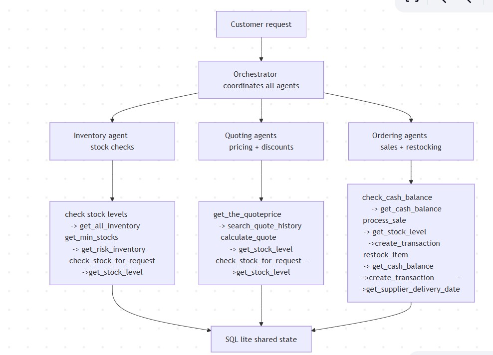

# Multi-Agent System: Inventory management, Quote pricing, and Sales
Multi-Agent System is a project implementing a multi-agent system that automates three core business operations for a fictional paper supply company — inventory management, quote generation, and order fulfillment

The system uses a 4-agent architecture built with the smolagents framework. A central Orchestrator receives every incoming customer request and coordinates three specialist agents, each responsible for one domain of the business. All agents communicate through a shared SQLite database rather than passing state objects between each other — this means every agent always works from the most current data without any synchronisation overhead.

The Inventory Agent monitors stock levels across all paper products and flags items that have fallen below their minimum reorder threshold. The Quoting Agent handles customer-facing price quotes — it checks stock availability, references historical quote data for pricing context, and applies a tiered discount structure based on order size. The Ordering Agent is the only agent that writes to the database — it confirms stock availability, records sale transactions, checks the company's cash position before restocking, and coordinates with the supplier to return delivery estimates.

## Sample Usage

### Input
A customer sends a natural language order request:
I would like to order 500 sheets of glossy paper, 300 sheets of A4 paper, 200 sheets of Large Poster Paper (24" x 36"), and 200 sheets of cardstock. Delivered by April 15, 2025.

### What Happens Behind the Scenes
1. The **Orchestrator** receives the request and coordinates the workflow
2. The **Inventory Agent** checks current stock levels for all requested items
3. The **Quoting Agent** calculates prices and applies tiered discounts
4. The **Ordering Agent** records confirmed transactions and flags 
   items with insufficient stock

### Output
The system returns a structured order summary:

Order Summary:

1. Glossy Paper

Quantity Requested: 500 sheets
Status: Insufficient stock (187 available)
Transaction ID: N/A

2. A4 Paper

Quantity Requested: 300 sheets
Transaction ID: 39
Total Charged: $14.25 (after discount)

3. Large Poster Paper (24" x 36")

Quantity Requested: 200 sheets
Transaction ID: 40
Total Charged: $190.00 (after discount)

4. Cardstock

Quantity Requested: 200 sheets
Transaction ID: 34
Total Charged: $28.50 (after discount)

**Overall Summary:**
- Glossy Paper is insufficient in stock.
- A4 Paper total: $14.25
- Large Poster Paper total: $190.00
- Cardstock total: $28.50 (insufficient stock for additional order)

Total Charges: $232.75 (Glossy Paper excluded — insufficient stock)

### Key Behaviours Demonstrated
- **Partial fulfilment** — 3 out of 4 items processed successfully
- **Stock transparency** — insufficient items flagged with available quantity
- **Automatic discounts** — tiered pricing applied without manual input
- **Transaction tracking** — real transaction IDs returned for every sale

